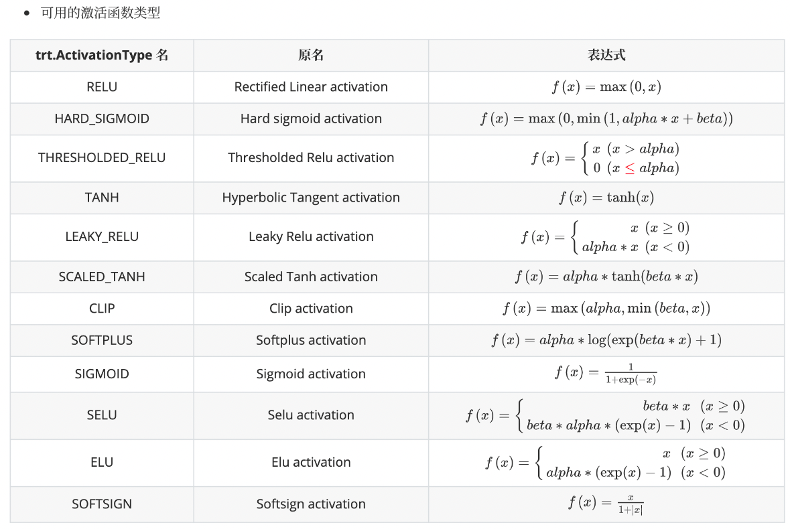

# Activation 层
+ 初始示例代码
+ type & alpha & beta

---
### 初始示例代码
```python
import numpy as np
from cuda import cudart
import tensorrt as trt

nIn, cIn, hIn, wIn = 1, 1, 3, 3  # 输入张量 NCHW
data = np.arange(-4, 5, dtype=np.float32).reshape(nIn, cIn, hIn, wIn)  # 输入数据

np.set_printoptions(precision=8, linewidth=200, suppress=True)
cudart.cudaDeviceSynchronize()

logger = trt.Logger(trt.Logger.ERROR)
builder = trt.Builder(logger)
network = builder.create_network(1 << int(trt.NetworkDefinitionCreationFlag.EXPLICIT_BATCH))
config = builder.create_builder_config()
inputT0 = network.add_input('inputT0', trt.float32, (nIn, cIn, hIn, wIn))
#-------------------------------------------------------------------------------# 替换部分
activationLayer = network.add_activation(inputT0, trt.ActivationType.RELU)  # 使用 ReLU 激活函数
#-------------------------------------------------------------------------------# 替换部分
network.mark_output(activationLayer.get_output(0))
engineString = builder.build_serialized_network(network, config)
engine = trt.Runtime(logger).deserialize_cuda_engine(engineString)
context = engine.create_execution_context()
_, stream = cudart.cudaStreamCreate()

inputH0 = np.ascontiguousarray(data.reshape(-1))
outputH0 = np.empty(context.get_binding_shape(1), dtype=trt.nptype(engine.get_binding_dtype(1)))
_, inputD0 = cudart.cudaMallocAsync(inputH0.nbytes, stream)
_, outputD0 = cudart.cudaMallocAsync(outputH0.nbytes, stream)

cudart.cudaMemcpyAsync(inputD0, inputH0.ctypes.data, inputH0.nbytes, cudart.cudaMemcpyKind.cudaMemcpyHostToDevice, stream)
context.execute_async_v2([int(inputD0), int(outputD0)], stream)
cudart.cudaMemcpyAsync(outputH0.ctypes.data, outputD0, outputH0.nbytes, cudart.cudaMemcpyKind.cudaMemcpyDeviceToHost, stream)
cudart.cudaStreamSynchronize(stream)

print("inputH0 :", data.shape)
print(data)
print("outputH0:", outputH0.shape)
print(outputH0)

cudart.cudaStreamDestroy(stream)
cudart.cudaFree(inputD0)
cudart.cudaFree(outputD0)
```

+ 输入张量形状 (1,1,3,3)
$$
\left[\begin{matrix}
    \left[\begin{matrix}
        \left[\begin{matrix}
            -4. & -3. & -2. \\
            -1. &  0. &  1. \\
             2. &  3. &  4.
        \end{matrix}\right]
    \end{matrix}\right]
\end{matrix}\right]
$$

+ 输出张量形状 (1,1,3,3)
$$
\left[\begin{matrix}
    \left[\begin{matrix}
        \left[\begin{matrix}
            0. & 0. & 0. \\
            0. & 0. & 1. \\
            2. & 3. & 4.
        \end{matrix}\right]
    \end{matrix}\right]
\end{matrix}\right]
$$

---
### type & alpha & beta
```python
    activationLayer = network.add_activation(inputT0, trt.ActivationType.RELU)
    activationLayer.type    = trt.ActivationType.CLIP                                               # 重设激活函数类型
    activationLayer.alpha   = -2                                                                    # 部分激活函数需要 1 到 2 个参数，.aplha 和 .beta 默认值均为 0
    activationLayer.beta    = 2
```

+ 指定 Clip 激活函数使输出值限制在 -2 到 2 之间，输出张量形状 (1,1，3,3)
$$
\left[\begin{matrix}
    \left[\begin{matrix}
        \left[\begin{matrix}
            -2. & -2. & -2. \\
            -1. &  0. &  1. \\
             2. &  2. &  2.
        \end{matrix}\right]
    \end{matrix}\right]
\end{matrix}\right]
$$

