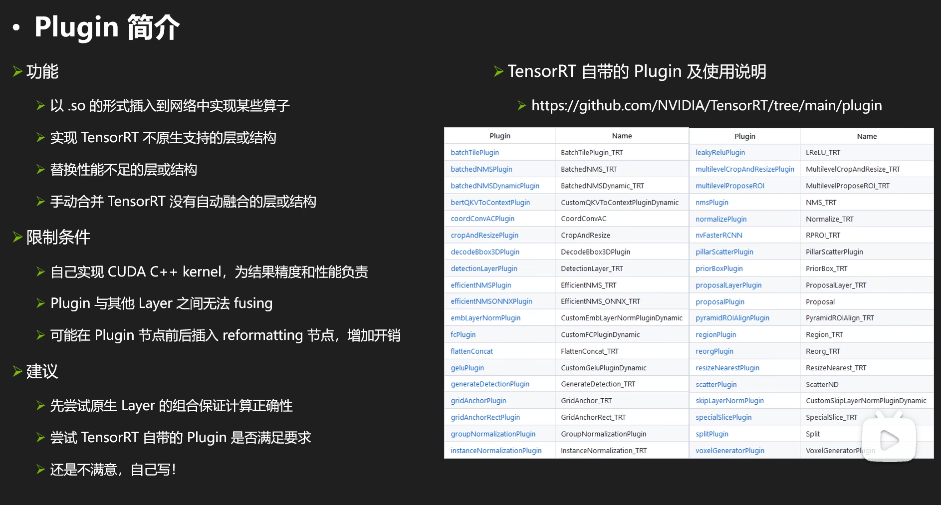
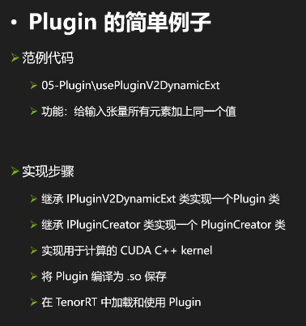
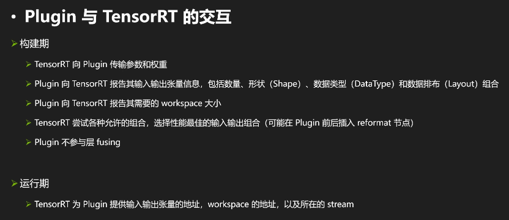
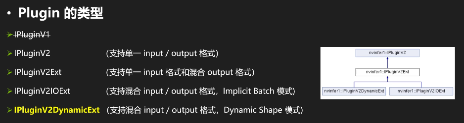
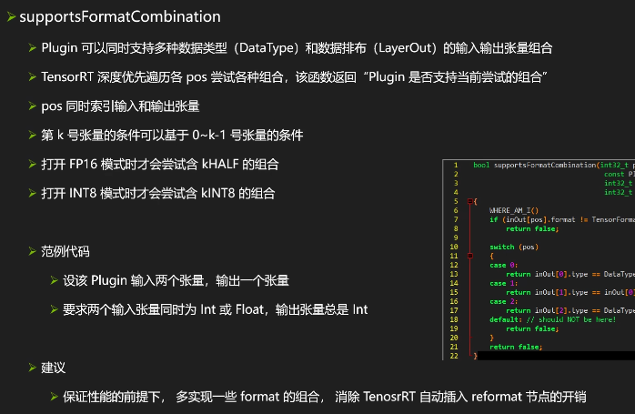

# Plugin Basic

## Introduction



## Example 1








1. Generate IPluginCreator constructor function

```cpp
class AddScalarPluginCreator : public IPluginCreator
{
private:
    static PluginFieldCollection    fc_;
    static std::vector<PluginField> attr_;
    std::string                     namespace_;

public:
    AddScalarPluginCreator();
    ~AddScalarPluginCreator();
    const char *                 getPluginName() const noexcept override;
    const char *                 getPluginVersion() const noexcept override;
    const PluginFieldCollection *getFieldNames() noexcept override;
    IPluginV2 *                  createPlugin(const char *name, const PluginFieldCollection *fc) noexcept override;
    IPluginV2 *                  deserializePlugin(const char *name, const void *serialData, size_t serialLength) noexcept override;
    void                         setPluginNamespace(const char *pluginNamespace) noexcept override;
    const char *                 getPluginNamespace() const noexcept override;
};
```

2. Get output tensor dimension

```cpp
DimsExprs AddScalarPlugin::getOutputDimensions(int32_t outputIndex, const DimsExprs *inputs, int32_t nbInputs, IExprBuilder &exprBuilder) noexcept
{
    WHERE_AM_I();
    return inputs[0];
}
```

3. write `supportsFormatCombination` funtion



```cpp
bool AddScalarPlugin::supportsFormatCombination(int32_t pos, const PluginTensorDesc *inOut, int32_t nbInputs, int32_t nbOutputs) noexcept
{
    WHERE_AM_I();
    switch (pos)
    {
    case 0:
        return inOut[0].type == DataType::kFLOAT && inOut[0].format == TensorFormat::kLINEAR;
    case 1:
        return inOut[1].type == inOut[0].type && inOut[1].format == inOut[0].format;
    default: // should NOT be here!
        return false;
    }
    return false;
#endif
}
```
