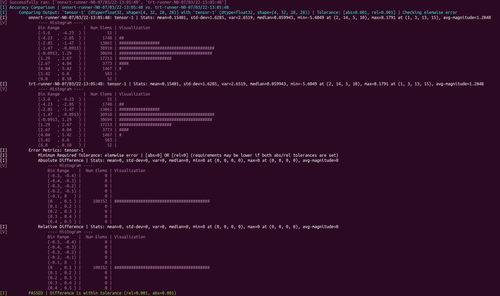

# Polygraphy Basic

## polygraphy run

> Example 1: 用上面的 .onnx 构建一个 TensorRT 引擎，使用 FP16精度，同时在 onnxruntime 和 TensorRT 中运行，对比结果

```bash
polygraphy run model.onnx \
    --onnxrt --trt \
    --workspace 1000000000 \
    --save-engine=model-FP16.plan \
    --atol 1e-3 --rtol 1e-3 \
    --fp16 \
    --verbose \
    --trt-min-shapes 'tensor-0:[1,1,28,28]' \
    --trt-opt-shapes 'tensor-0:[4,1,28,28]' \
    --trt-max-shapes 'tensor-0:[16,1,28,28]' \
    --input-shapes   'tensor-0:[4,1,28,28]' \
    > result-run-FP16.txt
```

```
# 注意参数名和格式跟 trtexec 不一样，多个形状之间用空格分隔，如：
# --trt-max-shapes 'input0:[16,320,256]' 'input1:[16，320]' 'input2:[16]'
```

> Example 2:  .onnx 构建一个 TensorRT 引擎，输出所有层的计算结果作对比

```bash
polygraphy run model.onnx \
    --onnxrt --trt \
    --workspace 1000000000 \
    --save-engine=model-FP32-MarkAll.plan \
    --atol 1e-3 --rtol 1e-3 \
    --verbose \
    --onnx-outputs mark all \
    --trt-outputs mark all \
    --trt-min-shapes 'tensor-0:[1,1,28,28]' \
    --trt-opt-shapes 'tensor-0:[4,1,28,28]' \
    --trt-max-shapes 'tensor-0:[16,1,28,28]' \
    --input-shapes   'tensor-0:[4,1,28,28]'
    > result-run-FP32-MarkAll.txt
```
part of output:
 

> Example 3: .onnx 构建一个 TensorRT 引擎，使用 FP32 精度，保存使用的脚本

```bash
polygraphy run model.onnx \
    --onnxrt --trt \
    --workspace 1000000000 \
    --save-engine=model-FP32.plan \
    --atol 1e-3 --rtol 1e-3 \
    --verbose \
    --gen-script="./polygraphyRun.py" \
    --trt-min-shapes 'tensor-0:[1,1,28,28]' \
    --trt-opt-shapes 'tensor-0:[4,1,28,28]' \
    --trt-max-shapes 'tensor-0:[16,1,28,28]' \
    --input-shapes   'tensor-0:[4,1,28,28]' \
    > result-run-FP32.txt
```

## polygraphy inspect

导出 .onnx 的详细信息
```bash
polygraphy inspect model model.onnx \
    --mode=full \
    > result-inspectOnnxModel.txt
```

用 .onnx 生成一个 .plan 及其相应的 tactics 用于后续分析
```bash
polygraphy run model.onnx \
    --trt \
    --workspace 1000000000 \
    --save-engine="./model.plan" \
    --save-tactics="./model.tactic" \
    --save-inputs="./model-input.txt" \
    --save-outputs="./model-output.txt" \
    --silent \
    --trt-min-shapes 'tensor-0:[1,1,28,28]' \
    --trt-opt-shapes 'tensor-0:[4,1,28,28]' \
    --trt-max-shapes 'tensor-0:[16,1,28,28]' \
    --input-shapes   'tensor-0:[4,1,28,28]'
```

导出上面 .plan 的详细信息（要求 TensorRT >= 8.2）
```bash
polygraphy inspect model model.plan \
    --mode=full \
    > result-inspectPlanModel.txt
```

导出上面 .tactic 的信息，就是 json 转 text
```bash
polygraphy inspect tactics model.tactic \
    > result-inspectPlanTactic.txt
```

导出上面 .plan 输入输出数据信息
```bash
polygraphy inspect data model-input.txt \
    > result-inspectPlanInputData.txt

polygraphy inspect data model-output.txt \
    > result-inspectPlanOutputData.txt    
```

### 确认 TensorRT 是否完全原生支持该 .onnx

```bash
polygraphy inspect capability model.onnx
# 输出信息：[I] Graph is fully supported by TensorRT; Will not generate subgraphs.
```

```bash
polygraphy inspect capability model-NonZero.onnx > result-NonZero.txt
# 产生目录 .results，包含网络分析信息和支持的子图(.onnx)、不支持的子图(.onnx)
```
